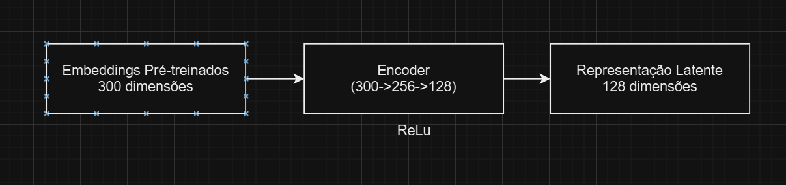
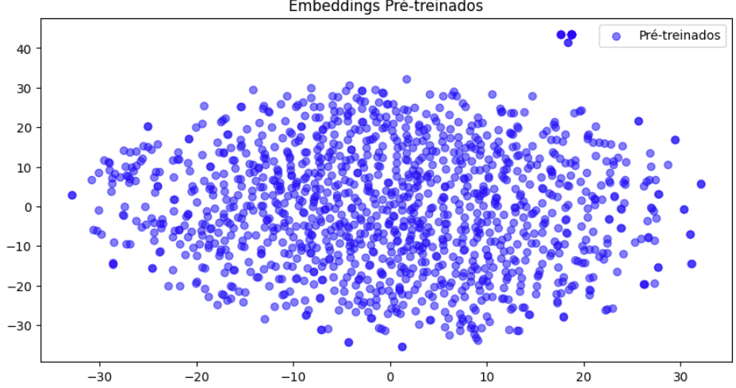
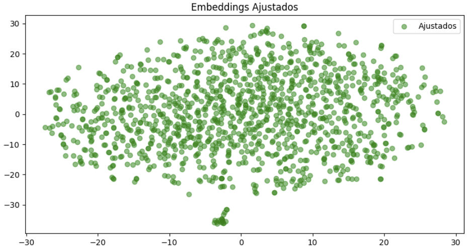

# APS 2 de NLP

Este projeto utiliza embeddings para representar textos em um espaço vetorial, iniciando com embeddings pré-treinados e aprimorando-os com um autoencoder. O objetivo é criar uma representação mais adequada para o nosso conjunto de dados, possibilitando sua aplicação em classificação de texto e similaridade semântica. O dataset contém descrições de filmes e emoções associadas, e é ideal para análise de sentimentos e tarefas de similaridade semântica.

Este projeto aprimora embeddings de texto usando um autoencoder em PyTorch, partindo de embeddings pré-treinados para capturar melhor as emoções descritas em textos. Utilizamos o modelo `all-MiniLM-L6-v2` da Sentence Transformers para gerar representações semânticas iniciais e, em seguida, treinamos um autoencoder para reduzir e ajustar esses embeddings de acordo com nosso dataset.

1. Embeddings Pré-treinados: Geramos embeddings de 300 dimensões para as descrições usando o all-MiniLM-L6-v2.
2. Autoencoder para Aprimoramento:
- Encoder: Reduz de 300 para 128 dimensões.
- Decoder: Reconstrói os embeddings originais.
- Hiperparâmetros:
    - Função de ativação: ReLU
    - Função de perda: MSELoss
    - Otimizador: Adam com lr = 0.001
    - Épocas: 100

A perda usada é MSELoss para medir a diferença entre embeddings originais e reconstruídos. O objetivo é minimizar essa diferença para que o autoencoder aprenda uma representação comprimida significativa para o nosso contexto. Ou seja, ele deve capturar as emoções e características semânticas dos textos de forma mais eficiente.

A fórmula da função de perda é dada por:

$$L = \frac{1}{n} \sum_{i=1}^{n} (x_i - \hat{x}_i)^2$$

Diagrama:

  

Onde:
- \( x_i \) é o embedding original.
- \( \hat{x}_i \) é o embedding reconstruído.
- \( N \) é o número de exemplos.

# Embedding Autoencoder - Resultados e Visualização

## Sobre o Projeto
Este projeto utiliza um autoencoder para ajustar embeddings de textos. O objetivo é observar como a adaptação dos embeddings afeta a formação dos clusters, utilizando técnicas de redução de dimensionalidade e visualização.

### Estrutura do Modelo
O modelo consiste em um autoencoder que foi treinado sobre embeddings gerados pelo modelo pré-treinado `paraphrase-MiniLM-L6-v2`. A rede é composta de camadas totalmente conectadas com funções de ativação ReLU e dropout para evitar overfitting.

### Resultados dos Embeddings

Após obter os embeddings utilizando o `SentenceTransformer`, os embeddings pré-treinados foram ajustados utilizando um autoencoder. Para visualizar as diferenças, aplicamos o `TSNE` para reduzir a dimensionalidade dos embeddings para 2 dimensões e então plotamos os resultados.

#### Embeddings Pré-treinados

No gráfico acima, podemos observar os embeddings na forma como foram originalmente gerados pelo modelo `SentenceTransformer`. Eles tendem a estar mais dispersos, pois não foram ajustados para capturar as características específicas do nosso conjunto de dados.

#### Embeddings Ajustados

Apesar de a separação entre clusters ter sido mais evidente nos embeddings ajustados, a distinção ainda não é totalmente clara. Isso indica que, embora o autoencoder tenha capturado características mais específicas do conjunto de dados, ele pode não ter sido suficiente para separar completamente os diferentes grupos. Esse resultado sugere que melhorias adicionais podem ser exploradas, como o ajuste dos parâmetros do autoencoder ou o uso de outras técnicas de ajuste que possam aprimorar ainda mais a representação dos dados e a separação entre clusters. Essa falta de uma separação clara pode apontar para a complexidade inerente dos dados, demandando abordagens mais robustas para obter uma representação ainda mais precisa.

Aqui estão alguns casos de teste com links diretos que você pode usar para testar a API:

Um Teste Que Retorna 10 Resultados
Consulta: `"romantic musical set in the 1980s"`
Comentário: Buscar por `"romantic musical set in the 1980s"` retorna 10 filmes relevantes que se enquadram nos gêneros de romance e música.
Um Teste Que Retorna Mais de 1, mas Menos de 10 Resultados
Consulta: `"action adventure"`
Comentário: Buscar por `"action adventure"` retorna um conjunto específico de filmes, provavelmente entre 2 e 9, pois é uma consulta mais nichada.
Um Teste Que Retorna Algo Não Óbvio
Consulta: `"cyberpunk detective noir"`
Comentário: Esta consulta pode retornar um resultado não óbvio, como um thriller de ficção científica que se encaixa no clima de `"cyberpunk detective noir"`, mesmo que essas palavras exatas não estejam na descrição do enredo. A relevância vem dos elementos temáticos, em vez de correspondências diretas de palavras-chave.
